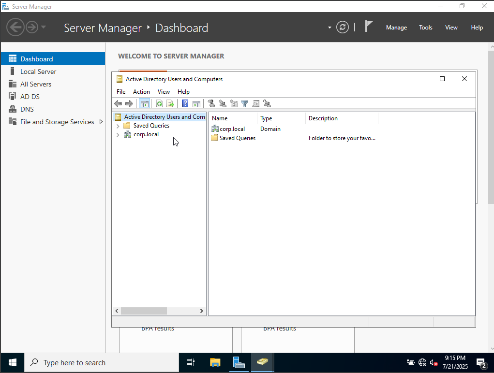
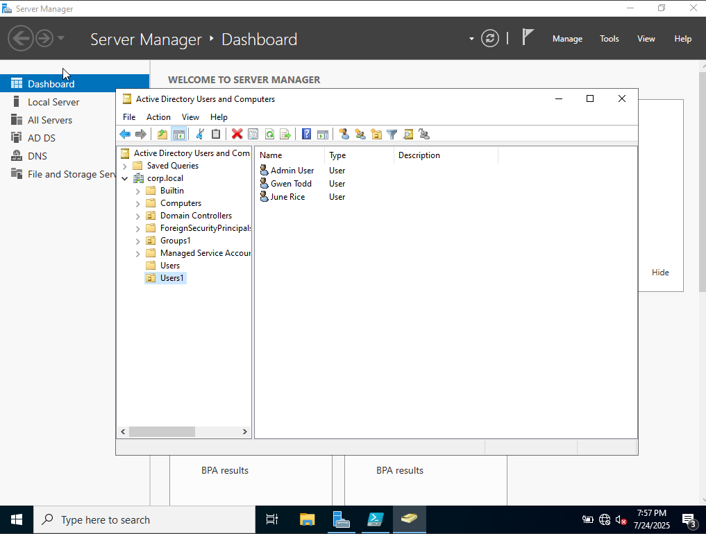
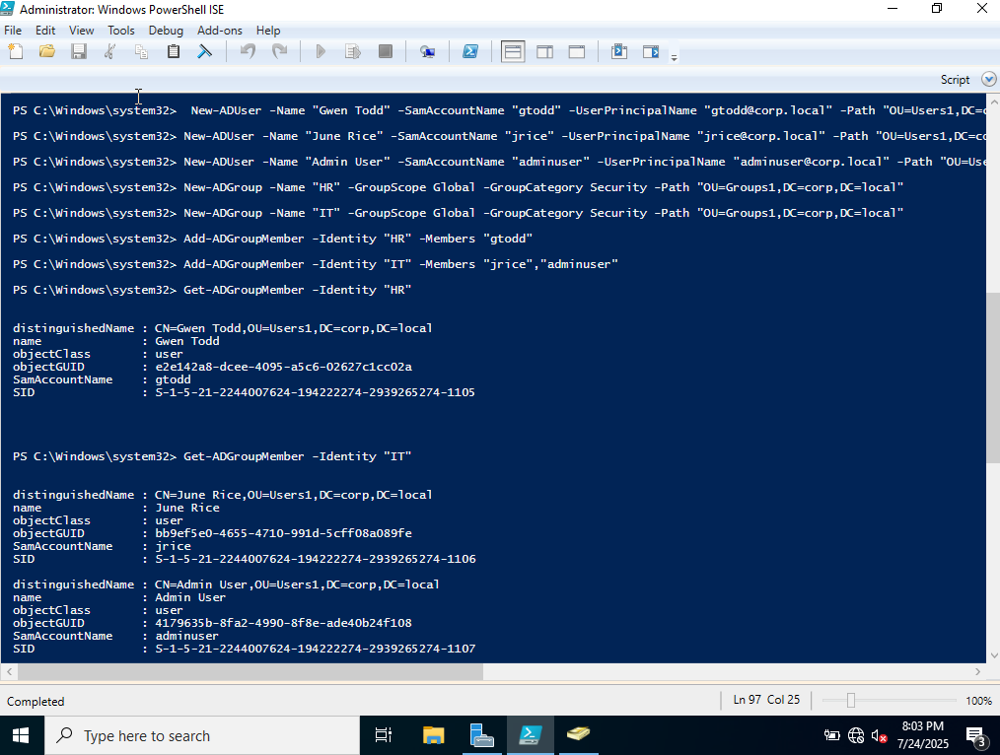
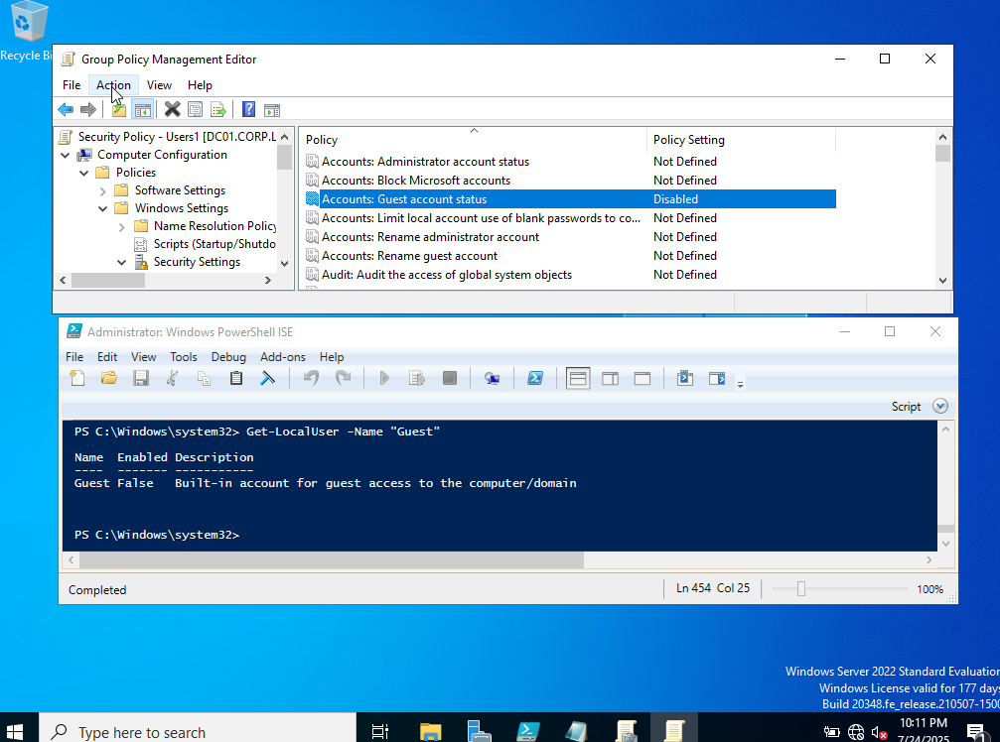
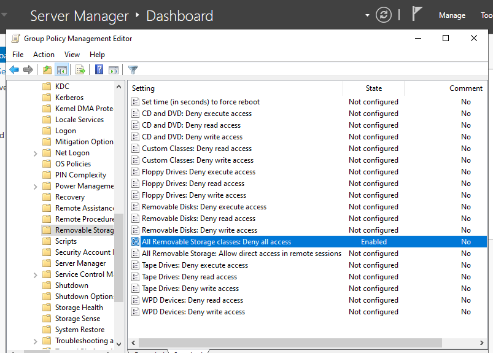
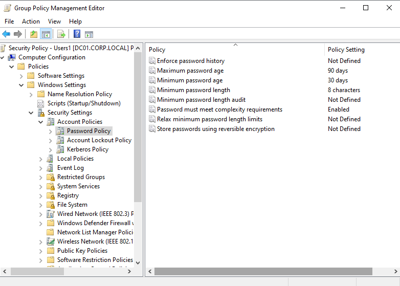

# 🧭 Active Directory Lab Walkthrough

This project simulates a production-ready Active Directory environment using Windows Server 2022 on Oracle VirtualBox. It walks through the full setup of a domain controller, user and group provisioning, Group Policy enforcement, and PowerShell automation.

---

## 🛠️ Starting from Scratch

I provisioned a new VM in Oracle VirtualBox and installed Windows Server 2022 (Desktop Experience). Before configuring Active Directory, I renamed the machine to `DC01` and assigned a static IP to ensure reliable DNS resolution and domain communication.

```powershell
Rename-Computer -NewName "DC01" -Restart

New-NetIPAddress -InterfaceAlias "Ethernet" -IPAddress 192.168.1.10 -PrefixLength 24 -DefaultGateway 192.168.1.1
Set-DnsClientServerAddress -InterfaceAlias "Ethernet" -ServerAddresses 192.168.1.10
```

---

## 🧩 Installing AD DS and Promoting the Server

With networking in place, I installed the Active Directory Domain Services role and promoted the server to a domain controller for `corp.local`.

```powershell
Install-WindowsFeature -Name AD-Domain-Services -IncludeManagementTools

Install-ADDSForest -DomainName "corp.local" -DomainNetbiosName "CORP" `
  -SafeModeAdministratorPassword (ConvertTo-SecureString "P@ssw0rd!" -AsPlainText -Force)
```



---

## 🗂️ Structuring the Directory

I created two Organizational Units (OUs): one for users and one for groups. This structure mirrors how enterprises separate identity objects for easier policy targeting and delegation.

```powershell
New-ADOrganizationalUnit -Name "Users1" -Path "DC=corp,DC=local"
New-ADOrganizationalUnit -Name "Groups1" -Path "DC=corp,DC=local"
```

---

## 👥 Provisioning Users and Groups

I created two sample users: Gwen Todd, June Rice, and adminuser, and two security groups: HR and IT. 

```powershell
New-ADUser -Name "Gwen Todd" -SamAccountName "gtodd" -UserPrincipalName "gtodd@corp.local" -Path "OU=Users1,DC=corp,DC=local" -AccountPassword (ConvertTo-SecureString "G!tHubL0v3r" -AsPlainText -Force) -Enabled $true

New-ADUser -Name "June Rice" -SamAccountName "jrice" -UserPrincipalName "jrice@corp.local" -Path "OU=Users1,DC=corp,DC=local" -AccountPassword (ConvertTo-SecureString "G!tHubL0v3r" -AsPlainText -Force) -Enabled $true

New-ADUser -Name "Admin User" -SamAccountName "adminuser" -UserPrincipalName "adminuser@corp.local" -Path "OU=Users1,DC=corp,DC=local" -AccountPassword (ConvertTo-SecureString "AdminPass123!" -AsPlainText -Force) -Enabled $true

New-ADGroup -Name "HR" -GroupScope Global -GroupCategory Security -Path "OU=Groups1,DC=corp,DC=local"

New-ADGroup -Name "IT" -GroupScope Global -GroupCategory Security -Path "OU=Groups1,DC=corp,DC=local"

Add-ADGroupMember -Identity "HR" -Members "gtodd"

Add-ADGroupMember -Identity "IT" -Members "jrice","adminuser"

```
<p align="center">
  
  
</p>

<p align="center">
  <strong>ADUC - New Users in OU</strong> &nbsp;&nbsp;&nbsp;&nbsp;&nbsp;&nbsp;&nbsp;&nbsp;&nbsp;&nbsp;&nbsp;&nbsp;&nbsp;&nbsp;&nbsp;&nbsp;&nbsp;&nbsp;&nbsp;&nbsp;&nbsp;&nbsp;&nbsp;&nbsp;&nbsp;
  <strong>Verify Memberships via PowerShell</strong>
</p>


---

## 🔐 Enforcing Security Policies

I disabled the built-in Guest account and applied Group Policy settings to restrict removable storage.

```powershell
Set-GPRegistryValue -Name "Security Policy - Users1" -Key "HKLM\SAM\SAM\Domains\Account\Users\Names\Guest" -ValueName "Enabled" -Type DWord -Value 0
Get-LocalUser -Name "Guest"

Name  Enabled Description                                             
----  ------- -----------                                             
Guest False   Built-in account for guest access to the computer/domain


Set-GPRegistryValue -Name "Security Policy - Users1" -Key "HKLM\Software\Policies\Microsoft\Windows\RemovableStorageDevices" -ValueName "Deny_All" -Type DWord -Value 1
```
<p align="center">
  
  
</p>

<p align="center">
  <strong>Guest Account Disabled</strong> &nbsp;&nbsp;&nbsp;&nbsp;&nbsp;&nbsp;&nbsp;&nbsp;&nbsp;&nbsp;&nbsp;&nbsp;&nbsp;&nbsp;&nbsp;&nbsp;&nbsp;&nbsp;&nbsp;&nbsp;&nbsp;&nbsp;&nbsp;&nbsp;&nbsp;
  <strong>Removable Devices Restricted</strong>
</p>
---

## 🔑 Password Policy Hardening

To align with enterprise security standards, I enforced a strong password policy using the Group Policy Management Console (GPMC). Although PowerShell is typically preferred for automation, registry editing restrictions prevented modification of the SAM hive, so I applied the policy through the GUI instead.

**Configured Settings via GPMC:**

- Minimum password length: 8 characters  
- Password complexity: Enabled  
- Maximum password age: 90 days  


---

## 🧠 What I Learned

- How to configure a domain controller from scratch using both GUI and PowerShell  
- The importance of static IPs and DNS in AD environments  
- How PowerShell can automate repetitive administrative tasks  
- How Group Policy enforces security across an enterprise  
- How to document technical work clearly for professional visibility  
- How to troubleshoot syntax errors and refine documentation iteratively
